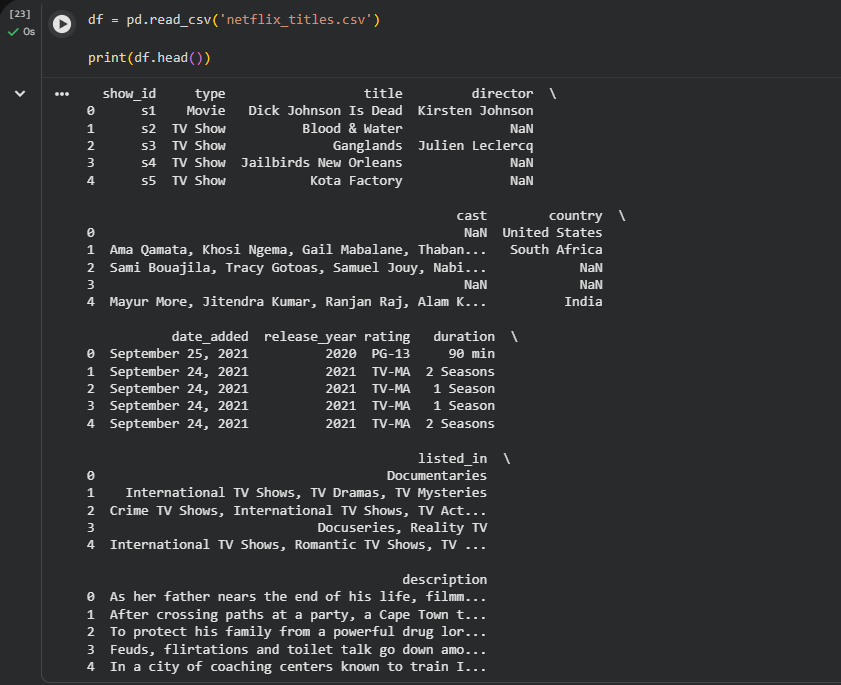
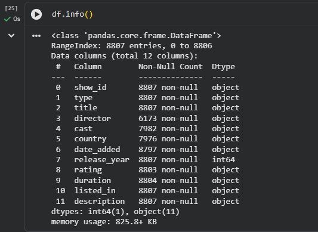
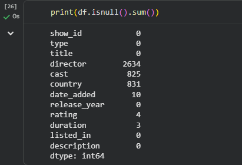
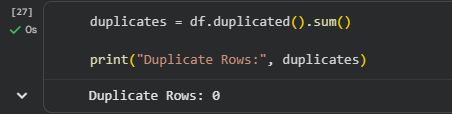
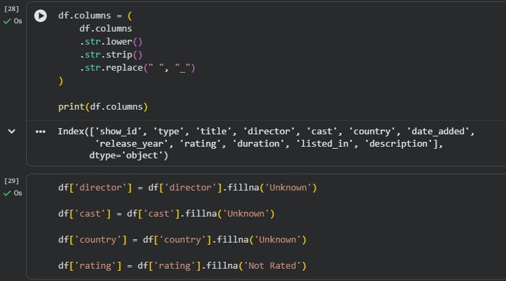
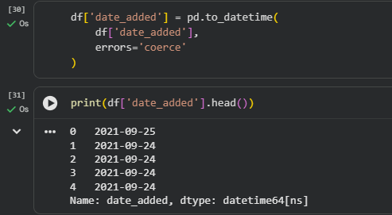
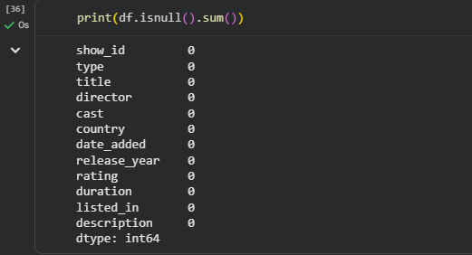
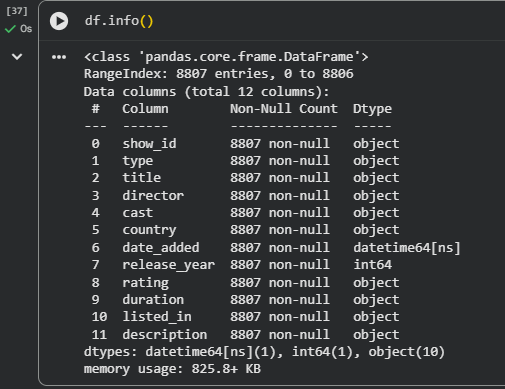
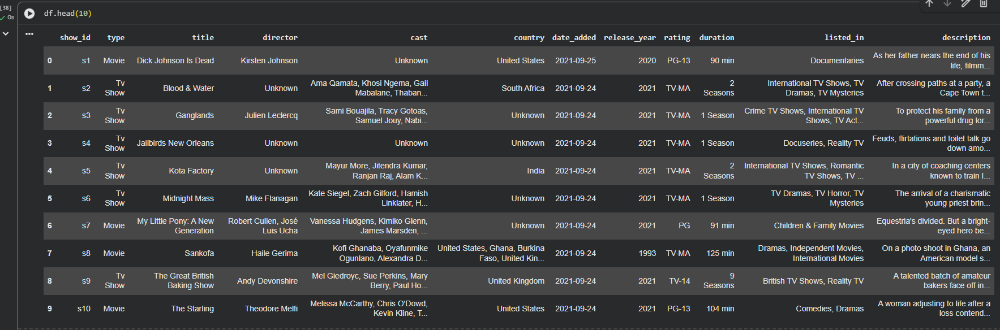

# Netflix Data Cleaning & Preprocessing

## 📌 Project Overview

This project focuses on cleaning and preprocessing the Netflix Movies and TV Shows dataset using Python and Pandas. The goal is to transform raw data into a clean, structured, and analysis-ready dataset by handling missing values, checking duplicates, standardizing formats, and correcting data types.

Data cleaning is a crucial step in the data analysis process because it improves data quality and ensures accurate insights and decision-making.

---

## 🎯 Objective

The objective of this project is to:

- Identify and handle missing values.
- Detect and remove duplicate records.
- Standardize text formatting.
- Convert date columns into a consistent format.
- Verify and correct data types.
- Prepare a clean dataset for future analysis and visualization.

---

## 🛠️ Tools & Technologies Used

- Python
- Pandas
- Google Colab
- CSV Dataset
- GitHub

---

## 📂 Dataset Information

**Dataset:** Netflix Movies and TV Shows

**Records:** 8,807

**Features:** 12 Columns

The dataset contains information about Netflix content, including:

- Show ID
- Type
- Title
- Director
- Cast
- Country
- Date Added
- Release Year
- Rating
- Duration
- Genre
- Description

---

## 🧹 Data Cleaning Steps Performed

### 1. Dataset Loading

Loaded the dataset using Pandas.

```python
import pandas as pd

df = pd.read_csv("netflix_titles.csv")
```

### 2. Missing Value Analysis

Identified missing values using:

```python
df.isnull().sum()
```

### 3. Duplicate Record Check

Checked for duplicate records:

```python
df.duplicated().sum()
```

### 4. Column Name Standardization

Converted column names to a consistent format:

- Lowercase letters
- Removed extra spaces
- Replaced spaces with underscores

### 5. Handling Missing Values

Filled missing values in:

- Director
- Cast
- Country
- Rating
- Date Added
- Duration

### 6. Date Format Conversion

Converted the `date_added` column into datetime format.

```python
df['date_added'] = pd.to_datetime(df['date_added'], errors='coerce')
```

### 7. Text Standardization

Standardized text values by:

- Removing extra spaces
- Applying consistent formatting

### 8. Data Type Verification

Verified all columns have appropriate data types.

```python
df.info()
```

### 9. Exporting Clean Dataset

Saved the cleaned dataset.

```python
df.to_csv("cleaned_netflix_titles.csv", index=False)
```

---

## 📸 Project Screenshots

### 1. Dataset Overview



### 2. Dataset Information Before Cleaning



### 3. Missing Values Before Cleaning



### 4. Duplicate Record Check



### 5. Column Names Cleaning



### 6. Date Format Conversion



### 7. Missing Values After Cleaning



### 8. Final Dataset Information



### 9. Cleaned Dataset Preview



---

## 📊 Results

After completing the cleaning process:

✅ Missing values handled successfully

✅ Duplicate records checked and removed if present

✅ Date formats standardized

✅ Column names cleaned and normalized

✅ Data types verified and corrected

✅ Dataset prepared for analysis and visualization

---

## 📁 Project Structure

```text
Netflix-Data-Cleaning-Preprocessing/
│
├── Netflix_Data_Cleaning_Task1.ipynb
├── README.md
├── netflix_titles.csv
├── cleaned_netflix_titles.csv
│
└── Screenshots/
    ├── 01_Dataset_Overview.png
    ├── 02_Dataset_Info_Before_Cleaning.png
    ├── 03_Missing_Values_Before_Cleaning.png
    ├── 04_Duplicate_Check.png
    ├── 05_Column_Names_Cleaning.png
    ├── 06_Date_Format_Conversion.png
    ├── 07_Missing_Values_After_Cleaning.png
    ├── 08_Final_Dataset_Info.png
    └── 09_Cleaned_Dataset_Preview.png
```

---

## 🎓 Learning Outcomes

Through this project, I gained practical experience in:

- Data Cleaning
- Data Preprocessing
- Handling Missing Values
- Duplicate Detection
- Data Quality Assessment
- Data Type Conversion
- Pandas Data Manipulation
- Real-World Dataset Preparation

---

## ✅ Conclusion

This project demonstrates the complete data cleaning and preprocessing workflow using Python and Pandas. The raw Netflix dataset was transformed into a clean, consistent, and analysis-ready dataset by addressing common data quality issues such as missing values, inconsistent formats, and data type mismatches.

The cleaned dataset can now be used for Exploratory Data Analysis (EDA), data visualization, and machine learning applications.

---

## 👨‍💻 Author

**Abhishek Savita**

GitHub: https://github.com/Abhishek-Savita-3012
